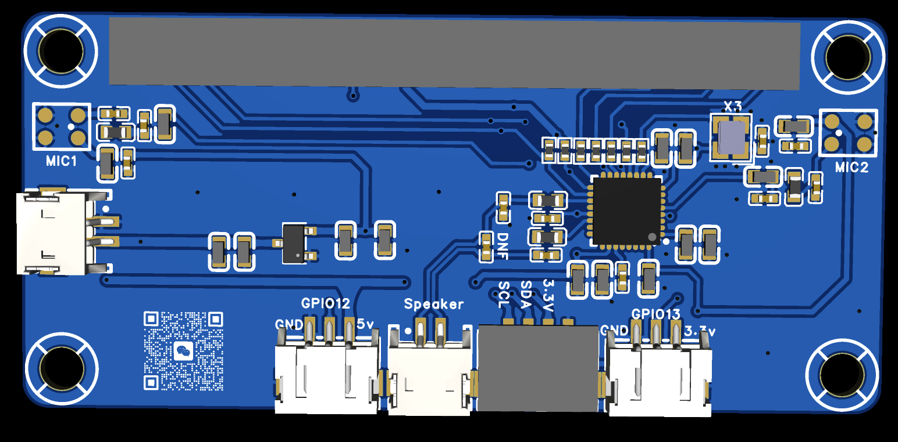
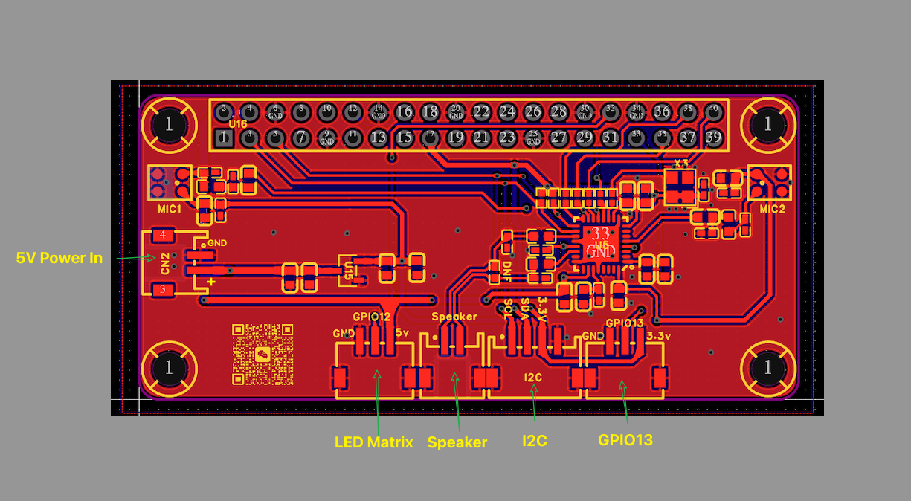

# LeLamp-Extend-Board

Extend board for project [LeLamp](https://github.com/humancomputerlab/LeLamp/tree/master), Easy and quick assembly

## Overview

LeLamp Extend board consists of five main interface: the **5V Power Input**, the **LED Matrix**, the **GPIO13** and the **I2C**, See the figure below.

## How to get it
- ### Proofing using the provided source files
- ### [PCBWay](https://www.pcbway.com/project/shareproject/LeLamp_Expansion_Board_38a28335.html)
- ### Buy on [Aliexpress bewait ]() or [淘宝](https://e.tb.cn/h.SQTekpxcpq8GLRg?tk=7IRnf2EZkhV HU293)
